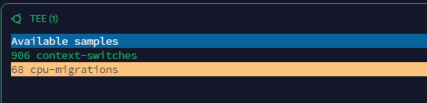
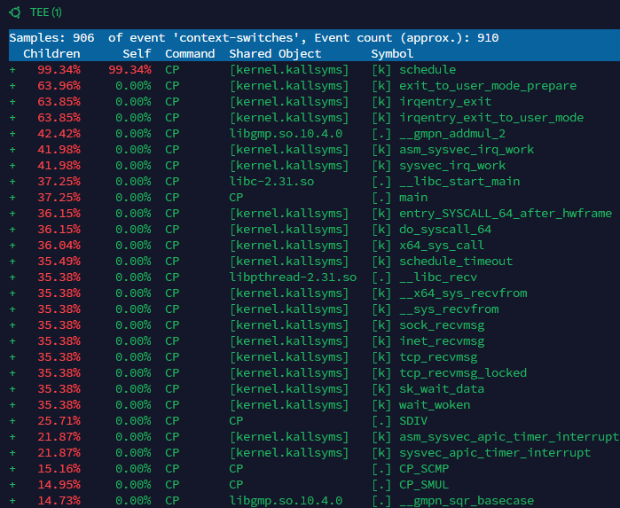
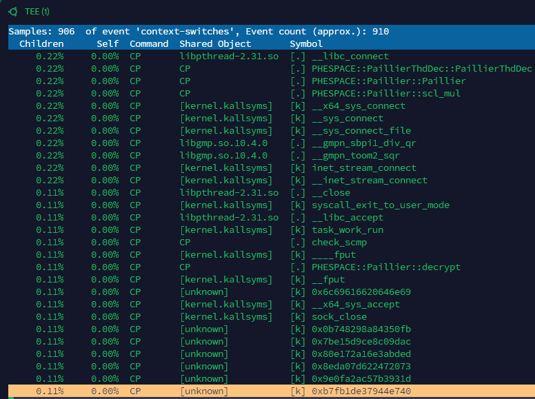
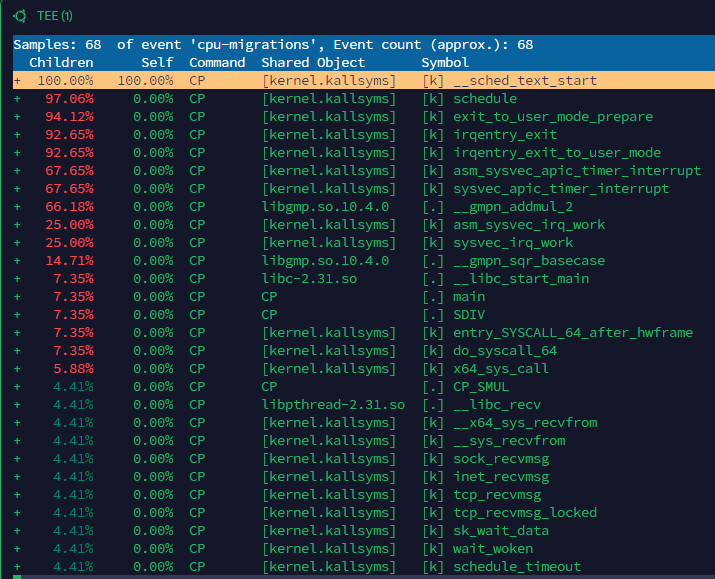
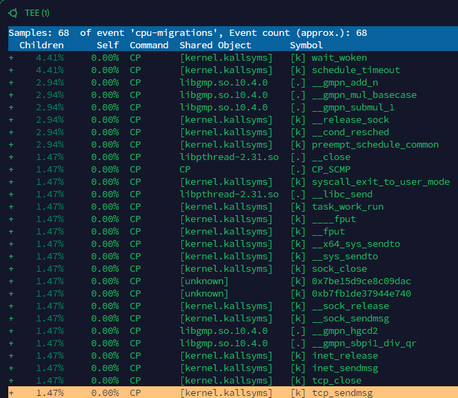
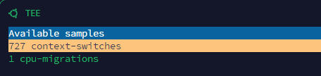
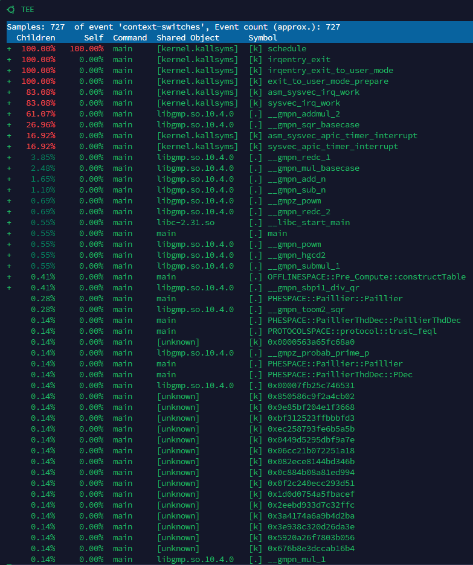
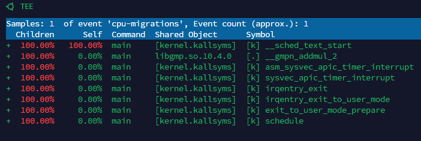

## 【Linux】socket_version/SOCI+_socket  — perf report 

### 01、906 context-switches

### 02、68 cpu-migrations

## 【Linux】simple_version/TRUST_C++ — report 

### 01、727 context-switches

### 01、1 cpu-migrations

